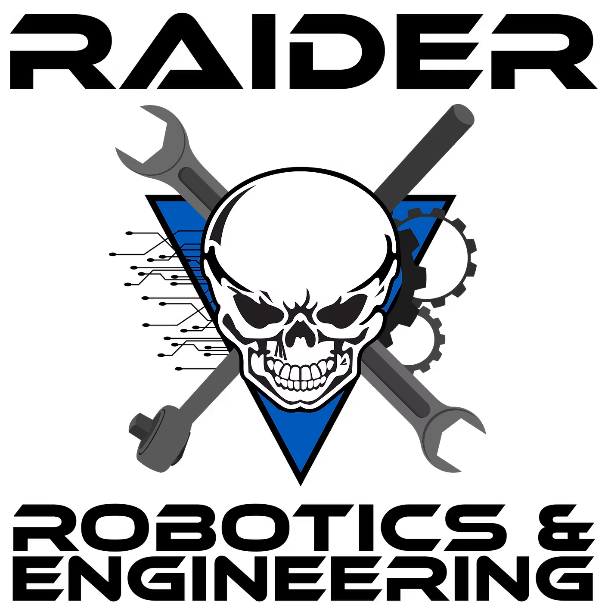
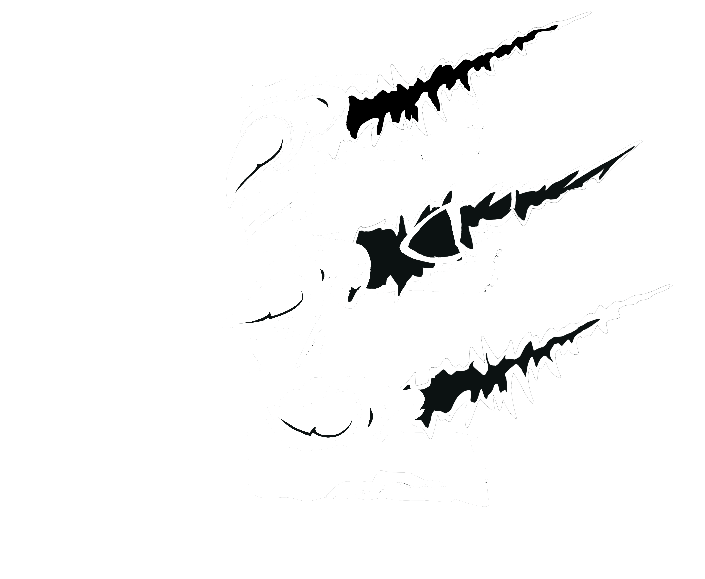

#  Team 8858's Code Repository

This is the codebase for [Team 8858 'Beast from the East'](https://www.thebluealliance.com/team/8858) and its tools.

In this Repository, we keep a record the code on each year's [FRC](https://www.firstinspires.org/robotics/frc) Robot of Team 8858.
- Under Each year will be Projects that were either the year's final code or snapshots from major milestones

We also keep general scripts that can be used for [analysis](analysis_scripts/) by parsing [The Blue Alliance's](https://www.thebluealliance.com) database and some of our [scouting tools](Scouting/).

#

 