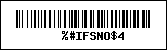
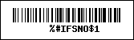
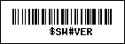
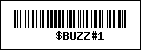
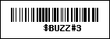
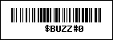
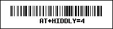
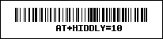
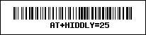

# Team 8858's Scouting Template
In this directory is an example template of where we paste data generated by [QRScout](http://frc2713.github.io/QRScout) from [Team 2713 Red Hawk Robotics](https://www.thebluealliance.com/team/2713)

Raw data can be added to the 'Raw Data' Page on QRScout Parsing Sheet Template.xlsx, then entering a team number into cell C2 on 'Analysis Sheet', the excel sheet will parse out stats for this team from the data entered by scouts.

## Barcode Reader Help
Team 8858 uses this [Barcode/QR code Scanner](https://www.amazon.com/dp/B0855MQ9Y6?ref=ppx_yo2ov_dt_b_fed_asin_title) to input scouting data into the scouting spreadsheet. Below are some of the barcodes which can help with configuration of this specific reader.

- To put Barcode reader into Bluetooth Pairing mode, scan this:

    

- To switch Barcode Reader to USB Dongle, scan this:

    

- To Display FW Versions, scan this:

    

### Volume Modes:
  - high volume:

    
  - low volume

    
  - mute

    

### Bluetooth Transmit Speed:
  - High Speed

    
  - Medium Speed

    
  - Low Speed

    

#
