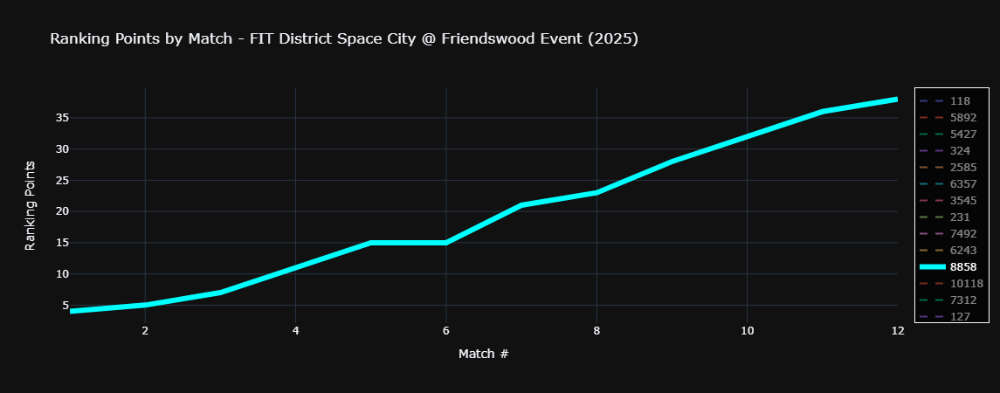
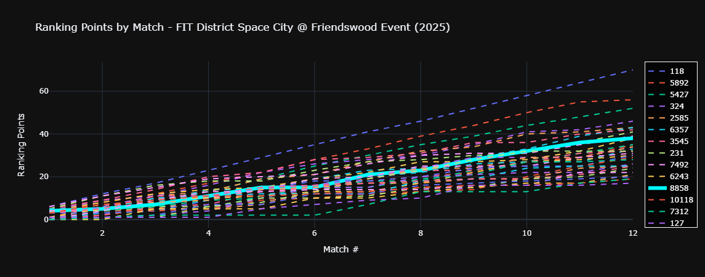
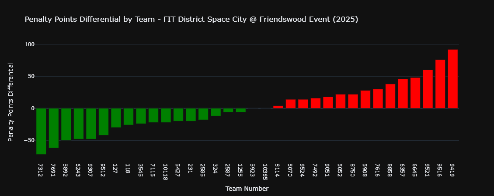

# Robotics Score Analysis

A Flask web application that analyzes event data from The Blue Alliance API for FRC robotics competitions. The application allows users to view team rankings based on ranking points, penalty points and provides detailed match breakdowns.

## Features

- View team events for a specific year
- Analyze penalty points for all teams in an event
- Interactive bar chart visualization of penalty point differentials
- Team rankings based on total penalty points and differentials
- Detailed match-by-match breakdown for selected teams

## Prerequisites

- Python 3.x
- Virtual Environment (recommended)
- The Blue Alliance API Key

## Installation

1. Clone the repository:
```bash
git clone <repository-url>
# navigate to this directory under the cloned repository
cd 8858_FRC_code/analysis_scripts/event_analysis
```

2. Create and activate a virtual environment:
```bash
python -m venv venv
# On Windows:
venv\Scripts\activate
# On Unix/MacOS:
source venv/bin/activate
# To exit the virtual environment when you're done:
deactivate
```

3. Install required packages:
```bash
python.exe -m pip install --upgrade pip # (optional) upgrade pip
pip install -r requirements.txt
```

4. Run the program:
```bash
python app.py
```
(This will generate the `api_key.py` file and print a link to [The Blue Alliance API key](https://www.thebluealliance.com/account/login?next=http://www.thebluealliance.com/account) which can be used to get your API Key.)

5. Once you have your API Key, open `api_key.py` and replace the assignment of `API_KEY` with the actual key within quotes:
```python
API_KEY = "your_api_key_here"
```

## Running the Application

1. Make sure your virtual environment is activated
2. Run the Flask application:
```bash
python app.py
```
3. Open your web browser and navigate to:
```
http://127.0.0.1:5000
```

## Usage

1. Enter a team number (e.g., 8858) and year (e.g., 2025)
2. Click "Find Events" to see all events for that team in the selected year
3. Select an event from the dropdown menu
4. Click "Analyze Event" to view:
   - Graph of selected team's ranking points over the event
     - example:
     
     - double-clicking on the legend will bring up all other teams to see your team's performance in context:
     
   - Bar chart of penalty point differentials
     - example:
     
   - Total penalty points rankings
   - Penalty points differential rankings
   - Match-by-match breakdown for the selected team

## Dependencies

- Flask: Web framework
- Requests: HTTP library for API calls
- Plotly: Interactive visualization library
