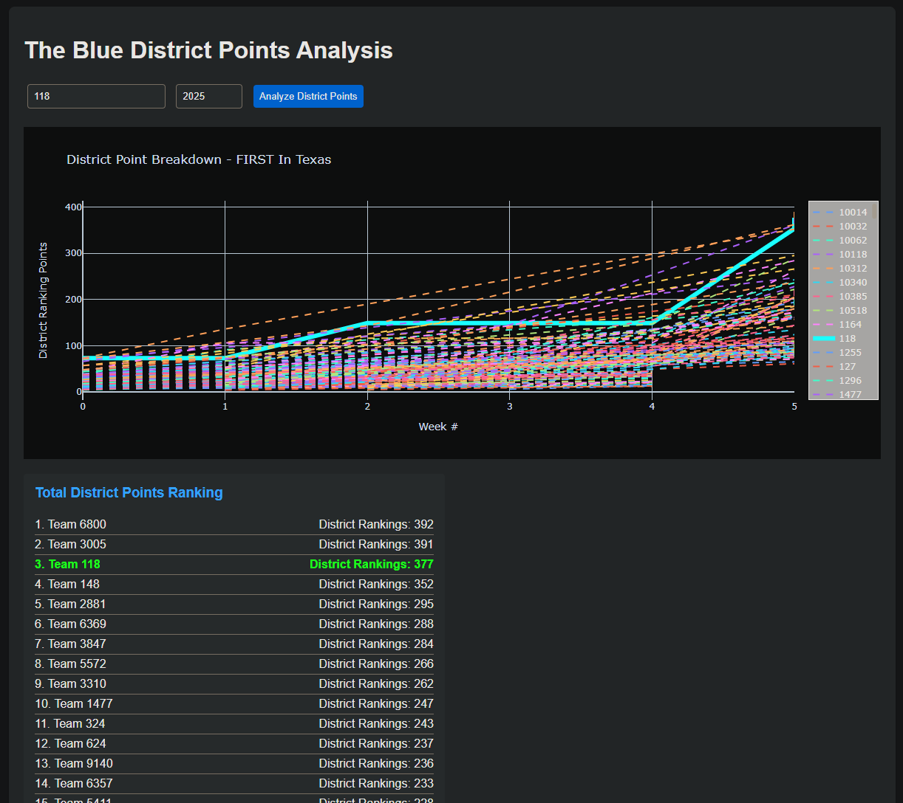

# Robotics Season

A Flask web application that analyzes event data from The Blue Alliance API for FRC robotics competitions. The application allows users to view team rankings based on ranking points, penalty points and provides detailed match breakdowns.

## Features

- Fetches which district the specified team belongs to for a given season
- Fetches which teams were also in that district for the specified season
- View an interactive graph how many district points each team has by week
- Highlights the specified team on the graph
- Also provides a breakdown of each team's current district point count (similar, more detailed infor can be found on [FRC Locks](http://www.frclocks.com/))

## Prerequisites

- Python 3.x
- Virtual Environment (recommended)
- The Blue Alliance API Key

## Installation

1. Clone the repository:
```bash
git clone <repository-url>
# navigate to this directory under the cloned repository
cd 8858_FRC_code/analysis_scripts/season_analysis
```

2. Create and activate a virtual environment:
```bash
python -m venv venv
# On Windows:
venv\Scripts\activate
# On Unix/MacOS:
source venv/bin/activate
# To exit the virtual environment when you're done:
deactivate
```

3. Install required packages:
```bash
python.exe -m pip install --upgrade pip # (optional) upgrade pip
pip install -r requirements.txt
```

4. Run the program:
```bash
python app.py
```
(This will generate the `api_key.py` file and print a link to [The Blue Alliance API key](https://www.thebluealliance.com/account/login?next=http://www.thebluealliance.com/account) which can be used to get your API Key.)

5. Once you have your API Key, open `api_key.py` and replace the assignment of `API_KEY` with the actual key within quotes:
```python
API_KEY = "your_api_key_here"
```

## Running the Application

1. Make sure your virtual environment is activated
2. Run the Flask application:
```bash
python app.py
```
3. Open your web browser and navigate to:
```
http://127.0.0.1:5000
```

## Usage

1. Enter a team number (e.g., 8858) and year (e.g., 2025)
2. Click "Analyze District Points" to view:
   - graph of each team's district points by week
   - chart showing each team's current district point standings

    Example:
    

## Dependencies

- Flask: Web framework
- Requests: HTTP library for API calls
- Plotly: Interactive visualization library
